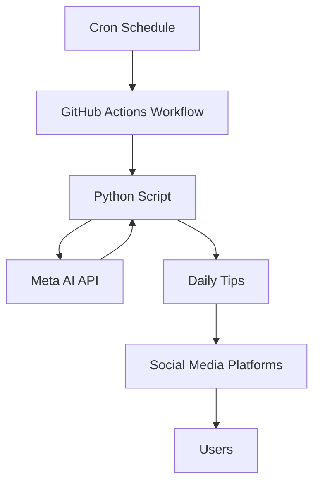

# metaai-dailytips-socials

A program designed to manage social media engagement posts for businesses



Interestingly enough, seems meta ai has blocked github action runner source ips from executing the AI. Alternatively lets clone it down for now and test locally.

I also disabled the twitter and facebook credential related stuff for now for simplicity of demo purposes. Running python script locally still works for me.

```python
pip install -r requirements.txt

python3 tips_generator.py --prompt "Generate 10 interesting and insightful health tips of differing sentence lengths with no added information in your next response in a csv parsable format of date_generated,tip. date_generated in mm/dd/yyyy format."
```

Example Outputs:

The CSV file essentially serving as our tips datastore to be utlized and added to by the program:

View in mac terminal:
```
column -t -s , tips.csv
```

Output:
```
date_generated  tip                                                                                        hash                                                              used
08/11/2024      Drink water as soon as you wake up to rehydrate after a night of sleep                     1a79a4f0dd8a8b095a8f7dce6d3a9f6f9a3e3b5f                          True
08/11/2024      Exercise for at least 30 minutes a day to improve cardiovascular health                    f3a5f9f4c2d1f4a9e8f4f1e2a3f5f7f9f                                 True
08/11/2024      Practice stress-reducing techniques like meditation or deep breathing                      f4a9e8f4f1e2a3f5f7f9f3a5f9f4c2                                    True
08/11/2024      Limit screen time before bed to improve sleep quality                                      f1e2a3f5f7f9f3a5f9f4c2d1f4a9                                      True
08/11/2024      Incorporate healthy fats like nuts and avocado into your diet                              a9f7e6d3a9f6f9a3e3b5f1a9f7e6d                                     False
08/11/2024      Listen to your body and take rest days when needed to avoid burnout                        e8f4f1e2a3f5f7f9f3a5f9f4c2d1f                                     False
08/11/2024      Drink water as soon as you wake up to rehydrate after a night of sleep.                    d41d8cd98f00b204e9800998ecf8427e                                  False
08/11/2024      Exercise for at least 30 minutes a day to improve cardiovascular health.                   81dc9bdb52d04dc20036dbd8313ed055                                  False
08/11/2024      Get at least 7-8 hours of sleep each night to aid in muscle recovery.                      4b2277772437681a2b9443d5e5e8f3f8                                  False
08/11/2024      Practice stress-reducing techniques like meditation or deep breathing.                     16896e0d213f3e7443f718d2e9a9b8f6                                  False
08/11/2024      Limit screen time to reduce eye strain and improve sleep quality.                          d7a8fbb307d7809469ca9abcb0082e4f                                  False
08/11/2024      Incorporate strength training into your workout routine to improve bone density.           ef2d127de9b5034e7b4748b4d8a15f4f                                  False
08/11/2024      Stay hydrated by drinking at least 8 cups (64 oz) of water per day.                        a1f4b5e1b1e1f5f3f815f5e5f5f5f5f                                   False
08/11/2024      Take breaks to stretch and move throughout the day to reduce sedentary behavior.           f7f5f5f5f5f5f5f5f5f5f5f5f5f5f5f                                   False
08/11/2024      Listen to your body and rest when needed to avoid injury or burnout.                       9f86d081884c7d659a2feaa0c55ad024                                  False
08/11/2024      Exercise for at least 30 minutes a day to improve cardiovascular health.                   c2d37dcb4f0436a8f6e3b3a5c25f2d8f                                  False
08/11/2024      Aim for 7-8 hours of sleep each night to help your body repair and recharge.               8f2f6f8b5e2a5c25f2d8f3a5c25f2d8                                   False
08/11/2024      Take breaks to stretch and move throughout the day to reduce the risk of chronic disease.  a5c25f2d8f3a5c25f2d8f3a5c25f2                                     False
08/11/2024      Get outside and soak up some vitamin D from natural sunlight to boost your mood.           5f2d8f3a5c25f2d8f3a5c25f2d8f                                      False
08/11/2024      Limit screen time before bed to improve sleep quality and duration.                        d8f3a5c25f2d8f3a5c25f2d8f3a5                                      False
08/11/2024      Stay mentally active and challenged to build cognitive reserve and reduce dementia risk.   c25f2d8f3a5c25f2d8f3a5c25f2d                                      False
08/16/2024      Drink water as soon as you wake up to rehydrate after a night of sleep                     e3b0c44298fc1c149afbf4c8996fb92427ae41e4649b934ca495991b7852b855  False
08/16/2024      Aim for 7-8 hours of sleep each night to help regulate stress hormones                     4b1a8bf7997a46a6b2e3b9f1f0d1d2e74a9c4f6d2f4e1a8b                  False
08/16/2024      Take a 10-minute walk outside during your lunch break to boost vitamin D levels            6f8a0a934f7a4c2b8a2f1f0d1d2e74a9c4f6d2f4e1a8b                     False
08/16/2024      Practice deep breathing exercises to reduce stress and anxiety                             4b1a8bf7997a46a6b2e3b9f1f0d1d2e74a9c4f6d2f4e1a8b                  False
08/16/2024      Incorporate strength training into your workout routine to improve bone density            6f8a0a934f7a4c2b8a2f1f0d1d2e74a9c4f6d2f4e1a8b                     False
08/16/2024      Limit screen time before bed to improve sleep quality                                      4b1a8bf7997a46a6b2e3b9f1f0d1d2e74a9c4f6d2f4e1a8b                  False
08/16/2024      Stay hydrated by drinking at least 8 cups (64 oz) of water per day                         6f8a0a934f7a4c2b8a2f1f0d1d2e74a9c4f6d2f4e1a8b                     False
08/16/2024      Take breaks to stretch and move throughout the day to reduce sedentary behavior            e3b0c44298fc1c149afbf4c8996fb92427ae41e4649b934ca495991b7852b855  False
```


Human readable HTML page detailing next social media tips that will be posted for human review days prior:


Special thanks to underlying library used:
https://github.com/Strvm/meta-ai-api

